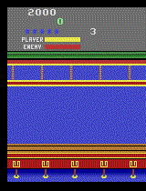

# Agent Jackie: Reinforcement Learning Adventures in Kung Fu

**Welcome to "Agent Jackie: Reinforcement Learning Adventures in Kung Fu" – an intensive and exhilarating journey into the heart of reinforcement learning (RL). In this condensed program, participants will rapidly traverse through the essentials of machine learning, delve into Python programming, and swiftly implement a Q-learning algorithm to train an agent for the classic game "Kung Fu Master" within the OpenAI Gym environment.**

## Problem Statement:

Develop an adaptive reinforcement learning (RL) agent, "Agent Jackie," tasked with mastering "Kung Fu Master" directly within the OpenAI Gym environment. This challenge involves implementing the Q-learning algorithm, navigating the exploration-exploitation trade-off, and optimizing strategies within the Markov Decision Process (MDP) framework. Notably, no external dataset is required, as the training process is conducted directly using the game environment, emphasizing the agent's ability to learn and strategize in real-time. The objective is to engineer an intelligent agent capable of efficiently navigating the game environment, strategically defeating opponents, and ultimately achieving Kung Fu mastery through RL principles and algorithmic prowess.

     

## Project Phases

### [Week 1: Introduction to Machine Learning and Python](<./Week 1/>)

- Quick overview of machine learning concepts.
- Fast-track Python programming for machine learning.
- Essential understanding of data preprocessing, model training, and evaluation.

### [Week 2: Introduction to Reinforcement Learning](<./Week 2/>)

- Swift definition of RL concepts.
- Distinction between supervised and RL.
- Basic RL terminology: agent, environment, state, action, reward.
- Understanding the exploration-exploitation trade-off.
- Rapid exploration strategies: epsilon-greedy, softmax, and others.

### [Week 3: Markov Decision Process and Value Iteration](<./Week 3/>)

- In-depth exploration of MDP as a formalism for RL.
- Comprehensive explanation of the value iteration algorithm.
- Providing a formal proof of convergence for the value iteration algorithm.
- Practical coding exercises to implement and understand the algorithm in Python.

### [Week 4-5 : Q-Learning Algorithm and Project Implementation](<./Week 4 & 5/>)

- Introduction to Q-learning as a model-free RL algorithm.
- Implementing Q-learning algorithm from scratch.
- Swiftly entering the OpenAI Gym environment, defining state space, action space, and rewards.
- Training the Kung Fu Master agent using Q-learning.
- Quick monitoring and visualization of the agent's learning progress.

## Project Conclusion and Evaluation

At the culmination of this sprint, participants will witness the trained agent's performance in playing Kung Fu Master, discuss challenges faced, and draw insights into RL implementation in a compact timeframe.
