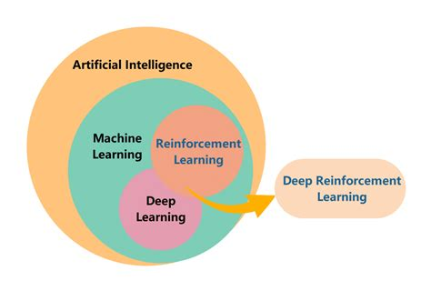
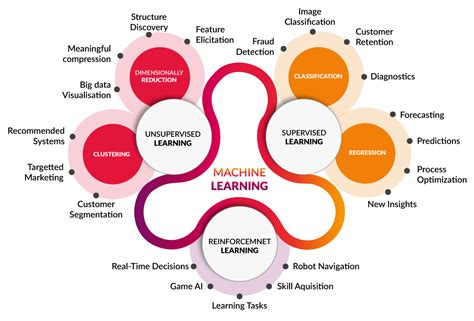

# Week 1: Introduction to Machine Learning and Python

_Howdy Fellas!_  
Welcome to an exciting journey in the realm of Reinforcement Learning🤖. This week we will be learning some basic concepts that may not seem important but are the basic pillars of anything MLeee or AI-kinda. We will begin with some content on Python and move on to understanding what Machine Learning means. Buckle up as we decode the language of machines and explore the fascinating world of intelligent algorithms. Let the journey commence! 🚀🌈

## Python

This is some content that will help Noobs master Python really fast and help Masters revise their knowledge (Sadly 😓 Python Syntax knowledge is exponentially decaying). If you already know the content then it is okay to skip some parts.

1. [**Learn Python from Scratch**](https://www.youtube.com/watch?v=L5sZ6WgOnj0): Learn Data Types, Operators, Conditional Statements, Loops, Strings, Lists, Tuples, Dictionaries, Sets, Functions. (_Optional_: File Handling)
2. [**Python OOP**](https://www.youtube.com/watch?v=qiSCMNBIP2g): Learn Classes & Objects, Inheritance and other concepts

## Machine Learning

Machine Learning is the core concept that is present in almost all AI. Reinforcement Learning is a part of Machine Learning though quite different from the traditional approaches previously used. 

     

In this week we are going to learn what Machine Learning means followed by a few simple algorithms used to predict data. We will actually learn what is behind the *black box* of the model and how it works.

     

We will begin with Supervised Learning and its two major types Regression and Classification.

> For the following resources you are required to create an account on Coursera and sign up. While starting the code you DO NOT need to pay anything. Just choose to Audit the course. For help, [click here](https://nutmegeducation.com/how-to-audit-a-coursera-course)

1. [Supervised Learning: Regression & Classification](https://www.coursera.org/learn/machine-learning/home/week/1)   
    [**Week 1: Introduction to Machine Learning**](https://www.coursera.org/learn/machine-learning/home/week/1)  
    - Overview of Machine Learning
    - Supervised vs. Unsupervised Machine Learning
    - Regression Model
    - Train the model with Gradient Descent

2. [Supervised Learning: Regression & Classification](https://www.coursera.org/learn/machine-learning/home/week/3)  
    [**Week 3: Classification**](https://www.coursera.org/learn/machine-learning/home/week/3) 
    - Classification with Logistic Regression
    - Cost Function for Logistic Regression
    - Gradient Descent for Logistic Regression
    - Problem of Overfitting

## NumPy, Pandas, and Matplotlib

These are simple libraries that have been created to make our work easy. They are highly used and are a must-learn for an ML Specialist. No need to memorize all syntax. You should just be able to use the appropriate functions when required.

1. **NumPy**  
    NumPy is the powerhouse of numerical computing in Python. It provides essential functionality for working with large, multi-dimensional arrays and matrices, along with a collection of high-level mathematical functions to operate on these arrays. NumPy is a fundamental library for scientific computing, enabling efficient and fast operations on numerical data.  
    [**NumPy for Beginners**](https://numpy.org/doc/stable/user/absolute_beginners.html)

2. **Pandas**  
    Pandas steps in as the data manipulation maestro, making working with structured data seamless. It introduces data structures like DataFrames, which are akin to tables in a database, allowing for easy indexing, slicing, and reshaping of datasets. Pandas is a game-changer for data preprocessing, cleaning, and analysis in Python, empowering data scientists to handle diverse datasets with ease.  
    [**Pandas for Beginners**](https://pandas.pydata.org/pandas-docs/stable/user_guide/10min.html)

3. **Matplotlib**  
    Visualization is key to understanding data, and Matplotlib is the go-to library for creating static, interactive, and animated plots in Python. Whether you need basic line charts or intricate heatmaps, Matplotlib provides a flexible and customizable platform for data visualization. It complements the analytical power of NumPy and Pandas, turning raw data into insightful visualizations for better comprehension and decision-making.  
    [**Matplotlib for Beginners**](https://www.datacamp.com/cheat-sheet/matplotlib-cheat-sheet-plotting-in-python)

## Extra Resources

1. [Supervised Learning: Regression & Classification](https://www.coursera.org/learn/machine-learning/home/week/2)   
    [**Week 2: Regression with Multiple Input Variables**](https://www.coursera.org/learn/machine-learning/home/week/2)  
    - Multiple Linear Regression
    - Gradient Descent in practice

2. [**NumPy Cheatsheet**](https://www.w3schools.com/python/numpy/numpy_getting_started.asp)
3. [**Pandas Cheatsheet**](https://www.w3schools.com/python/pandas/pandas_getting_started.asp)
4. [**Matplotlib Cheatsheet**](https://www.w3schools.com/python/matplotlib_getting_started.asp)

## Assignment 1

There will also be an assignment to check your understanding of this week's topic. The **deadline** will be **11:59 pm, 25th Dec (Mon)**. The assignment will be training a linear regression model on the given dataset. We will test the model on the hidden test dataset. The assignment will be hosted on Kaggle which is a wonderful platform to test your skills 🚀. This shall give you a brief introduction to this awesome website.  

Follow the given steps to access your assignment:
- Create an account on [Kaggle](https://www.kaggle.com)
- Join the competition using https://www.kaggle.com/t/54c575b375b34359ad9b8de7613cd65e
- Download the dataset, write the code in Python Notebook(.ipynb file), train the model for the training dataset, and get the predictions for the test dataset.
- Try plotting your model using Matplotlib and see if your model has fitted well to the training dataset.
- Upload the predictions to the Kaggle Competition.
- Enjoy 😎 
