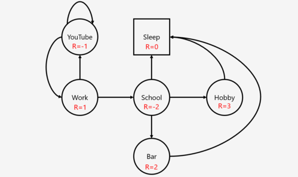

# Week 3: Markov Decision Process (MDP)
Greetings, Adventurers! Welcome to Week 3 of our thrilling journey through the realms of reinforcement learning. This week is packed with excitement as we delve deep into the fascinating universe of Markov Decision Processes (MDP).

## 🚀 Markov Decision Process

These resources will guide you through the mathematical formulation and introduce you to the terminologies that form the backbone of MDP.

<p align="center" width="100%">
     
</p>

1. [**Markov Decision Problem Part 1**](https://towardsdatascience.com/introduction-to-reinforcement-learning-markov-decision-process-44c533ebf8da)

2. [**Markov Decision Problem Part 2**](https://towardsdatascience.com/introduction-to-reinforcement-learning-markov-decision-process-44c533ebf8da)

3. [**Alternate slides for MDP**](https://www.davidsilver.uk/wp-content/uploads/2020/03/MDP.pdf)

## 💡 Solving MDP using Value Iteration

Now that you've mastered the fundamentals, let's gear up to solve MDPs using the powerful Value Iteration algorithm. I encourage everyone to comprehensively grasp this algorithm by thoroughly examining its proof and cultivating a strong intuition for its workings.

1. [**Solving MDP**](https://web.mit.edu/1.041/www/fall2021/www/lectures/L15-value-iteration-2021fa-pre.pdf) - Note that you can stop at Value iteration algorithm, further part containing Policy Iteration algorithm is not compuslory but is a good read.

## 🎓 Assignment 3

Hope you had an amazing, enjoyable week with Christmas 🎅 and New Year 🌟 and an awesome Bandit (maybe a tad bit Heavy🪨). Now this week will be even more fun (~~heavy~~). Your goal is to take in an **MDP** and plan it. That is for a given MDP, the *Value Iteration* algorithm should be able to give an action for each state that would result in optimality for the MDP.  
  
The MDP is given in the [data folder](./files/data.zip) in the format of *type-mdp-num_state-num_actions.txt* which contains the details of the MDP in the following form:
> **numStates** S  
**numActions** A  
**end** ed1 ed2 ... edn   
**transition** s1 ac s2 r p  
**transition** s1 ac s2 r p  
. . .  
. . .  
. . .  
**transition** s1 ac s2 r p  
**mdptype** mdptype  
**discount** gamma

The number of states S and the number of actions A will be integers greater than 1. Assume that the states are numbered 0, 1, ..., S - 1, and the actions are numbered 0, 1, ..., A - 1. Each line that begins with "**transition**" gives the reward and transition probability corresponding to a transition, where R(s1, ac, s2) = r and T(s1, ac, s2) = p. Rewards can be positive, negative, or zero. Transitions with zero probabilities are not specified. mdptype will be one of continuing and episodic. The discount factor gamma is a real number between 0 (included) and 1 (included). Recall that gamma is a part of the MDP: you must not change it inside your solver!

Your task is to first encode this txt file into an MDP in your python notebook and then give a list of value-action pairs for each state:
>V*(0) &nbsp;&nbsp;&nbsp; π*(0)  
	V*(1) &nbsp;&nbsp;&nbsp;  π*(1)  
	.  
	.  
	.  
	V*(S - 1) &nbsp;&nbsp;&nbsp; π*(S - 1)  

We have also provided you with [generateMDP.py](./generateMDP.py) which can be used to build different MDP's. You may use this syntax in your terminal(with different parameters) to create an MDP with 7 states, 5 actions and gamma 0.89. It will be episodic created using randomseed 21.
```shell
python .\generateMDP.py --S 7 --A 5 --gamma 0.89 --mdptype "episodic" --rseed 21 >> "./data/test"
```

  
To make your task easier we have provided with 6 MDP and solutions of 4 of them. We will give the solutions for the last 2 of them next week so remain on your toes.  
  
**Submission**: Same as last week upload the Notebook to your Github Page. Ensure that you first write the algorithm and then use it to solve for all 6 of the given MDP in seperate code blocks. Submission Deadline is **11:59 pm, 7 Jan**. Have a fun week 🚀.
